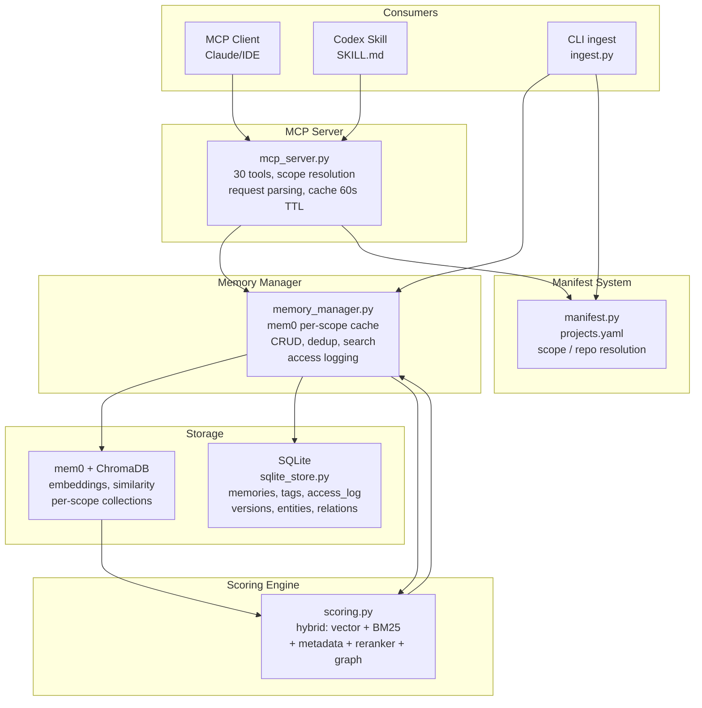

# Architecture

## Overview

Project Memory is a scoped, local memory and context system for agent workflows. It stores structured knowledge (decisions, code summaries, architecture notes, documentation excerpts) in a dual-layer storage backend — a vector store (ChromaDB via mem0) for semantic retrieval plus SQLite for fast metadata access, entity graphs, and audit logging. The system is exposed via two interfaces: an MCP server for agent tools, and a CLI for repository ingestion and maintenance.

A key concept is the **scope** (`project_id`), which namespaces all stored memories. A scope can represent a project, domain, workstream, incident, or any durable context boundary. Each scope maps to its own Chroma collection and SQLite records.

---

## Component Map

Source: [docs/diagrams/project-memory.mmd](diagrams/project-memory.mmd)



---

## Dual-Layer Storage

The system uses two complementary storage layers:

| Layer | Technology | Role | Access Pattern |
|-------|-----------|------|----------------|
| Vector store | ChromaDB (via mem0) | Semantic search, embeddings | Similarity queries |
| Metadata store | SQLite | Fast lookups, filtering, audit, graphs | Exact queries, joins |

**Why two layers?**
- ChromaDB excels at approximate nearest-neighbor search over embeddings but is not efficient for structured queries (filter by tag, date range, category).
- SQLite handles structured metadata cheaply, enables rich filtering before or after vector search, and supports features like versioning, entity graphs, and access analytics that would be awkward in a vector DB.
- On `store_memory`, both layers are written atomically: mem0 embeds and stores the body, SQLite records the metadata record.

---

## Data Flow: `store_memory`

```
store_memory(content, project_id, category, tags, ...)
        │
        ▼
1. Compute fingerprint (SHA256 of normalized content hash)
        │
        ▼
2. Deduplication check
   └─ if fingerprint exists in scope → skip (return existing ID)
        │
        ▼
3. mem0.add() → Ollama embedding → Chroma insert
        │
        ▼
4. SQLite insert (memories, memory_tags tables)
        │
        ▼
5. Entity extraction (entity_extraction.py)
   └─ link entities to memory in entities/memory_entities tables
        │
        ▼
6. Optional: tag suggestion (tagging.py, TF-IDF)
        │
        ▼
Return: {memory_id, deleted_count, suggested_tags}
```

---

## Data Flow: `search_context`

```
search_context(query, project_id?, ...)
        │
        ▼
1. Scope resolution (manifest.py)
   ├─ explicit project_id/project_ids → use directly
   ├─ infer from query tokens vs project tags/descriptions
   └─ fallback: PROJECT_ID env + org_practice_projects
        │
        ▼
2. Cache check (60s TTL, keyed on query + scope + filters)
   └─ cache hit → return immediately
        │
        ▼
3. Per-scope vector search via mem0 (Chroma)
   └─ returns top-N candidates (default candidate_pool=200)
        │
        ▼
4. SQLite metadata enrichment
   └─ join tags, category, source_kind, fingerprint, access_log
        │
        ▼
5. Hybrid scoring (scoring.py)
   ├─ vector similarity: 0.25
   ├─ BM25 lexical: 0.18
   ├─ repo metadata: 0.12
   ├─ recency: 0.08
   ├─ reranker (cross-encoder): 0.22
   ├─ entity/graph: 0.10
   └─ access history: 0.05
        │
        ▼
6. Reranking (optional, BAAI/bge-reranker-v2-m3)
   └─ re-scores top-N candidates (default rerank_top_n=40)
        │
        ▼
7. Candidate packing (scoring.py PackingConfig)
   ├─ max 3 results per repo
   ├─ max 3 results per category
   ├─ decision/architecture categories pinned higher
   └─ token budget enforcement (~1800 tokens default)
        │
        ▼
8. Format (formatting.py)
   └─ text: concise excerpts with scope_source header
      json: IDs + metadata + excerpts
        │
        ▼
9. Access log write (SQLite access_log table)
   └─ records query, result rank positions, timestamps
```

---

## Data Flow: `ingest_repo`

```
ingest_repo(project, repo, mode, ...)
        │
        ▼
1. Manifest resolution (manifest.py)
   └─ load repo root, include/exclude globs, default_tags
        │
        ▼
2. File collection (ingest.py collect_files())
   └─ traverse root with glob matching, apply exclusions
        │
        ▼
3. Per-file chunking (chunking.py chunk_file())
   ├─ .py  → python docstrings + code chunks
   ├─ .md  → heading-aware markdown chunks
   ├─ .pdf → page-aware PDF blocks
   └─ other → sliding-window text chunks
        │
        ▼
4. Per-chunk processing:
   ├─ compute fingerprint
   ├─ merge manifest default_tags with any passed tags
   ├─ dedup check: skip if fingerprint already exists
   └─ store via Memory Manager → mem0 + SQLite
        │
        ▼
5. Post-ingest cleanup:
   └─ delete old chunks for re-ingested files (by source_path)
        │
        ▼
Return: summary {stored, skipped, deleted}
```

---

## Scope Resolution Order

When `project_id` is not explicitly provided:

```
1. Explicit override (project_id / project_ids parameter)
        │ (if not provided)
        ▼
2. repo default_active_project (from manifest repos section)
        │ (if repo not specified or no default)
        ▼
3. Query-text inference
   └─ tokenize query → match against project tags/descriptions
      → return top-2 scoring projects (configurable)
        │ (if inference returns empty results)
        ▼
4. Retry with: PROJECT_ID env + org_practice_projects
        │ (still empty)
        ▼
5. PROJECT_ID environment variable fallback
   default: "project-memory-default"
```

The response header `scope_source` indicates which level resolved: `explicit`, `inferred`, `fallback`, or `retry`.

---

## Key Design Decisions

**Why fingerprint-based deduplication?**
Re-ingesting a repo is common (file edits, manifest changes). Fingerprinting (SHA256 of normalized content) lets the system skip unchanged chunks cheaply without querying the vector store, keeping ingestion idempotent.

**Why hybrid scoring over pure vector search?**
Pure cosine similarity misses exact keyword matches (e.g., function names, error codes). BM25 captures term frequency but misses semantic similarity. The hybrid formula balances both, with the cross-encoder reranker providing a final precision pass for the top candidates.

**Why manifest-driven scope?**
Agents operate across many repos and workstreams. A manifest externalizes the mapping between codebases and memory scopes, making it easy to add repos to a scope or reassign a scope without touching agent code. Inference from query text means agents don't need to know the scope name explicitly.

**Why separate SQLite from ChromaDB?**
Chroma handles one thing well: approximate nearest-neighbor search. Everything else — filtering by tag, date range, category; access logs; version history; entity graphs; dedup checks — benefits from SQL's relational model. The combination avoids overloading Chroma with metadata logic it wasn't designed for.
